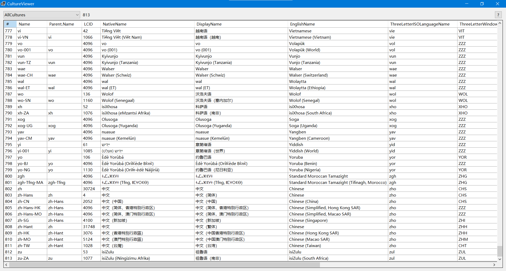

# CultureViewer
CultureViewer lists culture data from system, a simple program included in [KNSoft.org](https://knsoft.org) Toolkit.

## Screenshots

## Requirements
+ IDE: Latest Visual Studio (VS2019)
+ Runtime and SDK: Latest .NET (.NET 5.0)

## Data source
CultureViewer acquires culture data by calling [CultureInfo](https://docs.microsoft.com/dotnet/api/system.globalization.cultureinfo) class in [System.Globalization](https://docs.microsoft.com/dotnet/api/system.globalization) namespace. The result is depends on .NET platform and OS version, for more information, see [CultureInfo.GetCultures](https://docs.microsoft.com/dotnet/api/system.globalization.cultureinfo.getcultures) method.